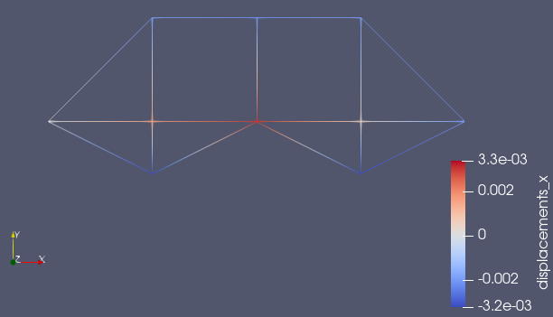
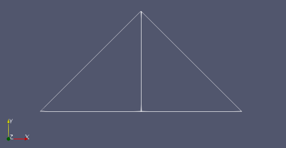
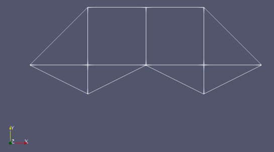
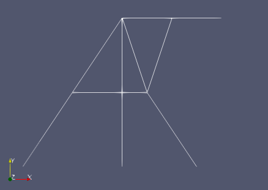

# trussfem

Finite element method implementation for truss structures



## Usage

Run the `main.py` with the task file specified:
```python
> python main.py tasks/task_1.json
```
The script produces results in VTK format:
- `displacements.vtk`,
- `strains.vtk`,
- `stresses.vtk`.

## Units

- Young's modulus in Pascals,
- coordinates in meters,
- areas in squared meters,
- loads in Newtons,
- displacements in meters,
- stresses in Pascals.

## Task

Task description must be created in JSON format.

Task object example.
```json
{
  "name": "One-element frame stretch",
  "youngs_modulus": 200000000000,
  "poisson_coefficient": 0.25,
  "truss": {
    "nodes": [
      {"id": 0, "x": 0.0, "y": 0.0},
      {"id": 1, "x": 5.0, "y": 0.0}
    ],
    "elements": [
      {"id": 0, "nodes": [0, 1], "profile_area": 0.0001}
    ]
  },
  "constraints": [
    {"id": 0, "node_id": 0, "constraint_x": true, "constraint_y": true}
  ],
  "loads": [
    {"id": 0, "node_id": 1, "load_x": 30000.0, "load_y": 0.0}
  ]
}
```

## Predefined tasks

- tasks/task_1.json : Simple one-element stretching
- tasks/task_2.json : Three element stretching. See [1], [3].
- tasks/task_3.json : Example from [2, p27].

  

- tasks/task_4.json : Example from [4, p15].

  

- tasks/task_5.json : Truss from [5, p105].

  

## References

1. https://isopromat.ru/sopromat/primery-reshenia-zadach/raschet-deformacij/pri-rastyazhenii-szhatii
2. Кондратьева ЛЕ - Основы метода конечных элементов. Введение. Расчет стержневых систем (2007)
3. https://isopromat.ru/sopromat/primery-reshenia-zadach/postroenie-epur/normalnyh-napryazhenij-pri-rastyazhenii-szhatii
4. Артамонова ЕН, Зайцева ИМ - Расчет фермы
5. Галлагер Р - Метод конечных элементов. Основы (1984)
6. Зенкевич О - Метод конечных элементов в технике (1975)
7. Маклаков СФ - Расчет стержневых систем методом конечных элементов (2008)
8. Хабр - Написание МКЭ расчетчика в менее чем 180 строк кода
